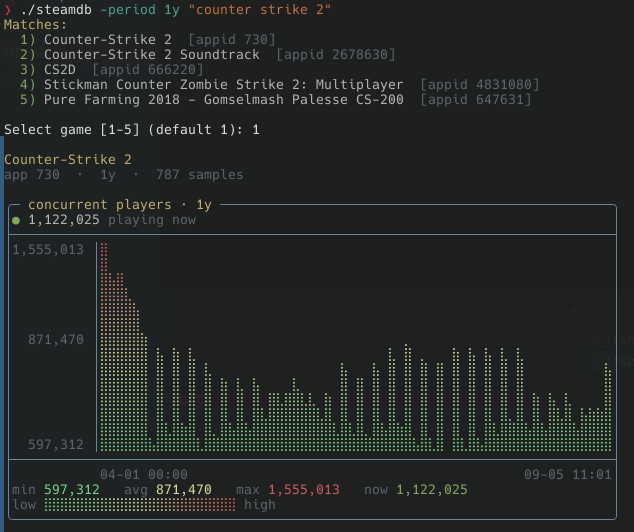

# steamdb

Terminal CLI that looks up Steam games by name and draws a ASCII chart of concurrent players over time.

It searches the Steam Store, reads the live player count from Steam’s Web API, and plots history from [SteamCharts](https://steamcharts.com) — no API key required.



## Requirements

- [Go](https://go.dev/dl/) 1.22+ (module declares Go 1.27)
- Network access to Steam and SteamCharts

## Build

```bash
git clone https://github.com/Goonie-Software/steamdb.git
cd steamdb
go build -o steamdb ./cmd/steamdb
```

Install into your `GOPATH`/`GOBIN`:

```bash
go install ./cmd/steamdb
```

Run without installing:

```bash
go run ./cmd/steamdb -- "counter-strike 2"
```

## Usage

```bash
./steamdb <game name>
./steamdb -appid 730 -period 24h
```

| Flag | Default | Description |
|------|---------|-------------|
| `-period` | `7d` | Chart window: `24h`, `7d`, `30d`, `90d`, `1y`, `all` |
| `-appid` | — | Skip search; chart this Steam AppID |
| `-pick` | — | Choose a numbered search match (non-interactive) |
| `-list` | — | List search matches only |
| `-width` / `-height` | `64` / `14` | Chart size |
| `-no-color` | — | Disable ANSI colors (also respects `NO_COLOR`) |
| `-no-legend` | — | Hide the gradient legend |

### Examples

```bash
./steamdb "counter-strike 2"
./steamdb elden ring -period 30d
./steamdb -appid 570 -period 24h
./steamdb dota -list
./steamdb terraria -pick 1 -no-legend
```

If several games match, the tool lists them and prompts for a choice (or use `-pick`).

## Testing

Unit tests are table-driven and run offline (Steam/SteamCharts calls are mocked with `httptest`).

```bash
# all packages
go test ./...

# verbose
go test ./... -v

# race detector
go test ./... -race
```

| Package | What’s covered |
|---------|----------------|
| `internal/chart` | Period parsing, filtering, resampling, ASCII/color rendering |
| `internal/steam` | Store search, player count, app name, chart history |
| `cmd/steamdb` | Flag/arg reordering and number formatting |

### Benchmarks

```bash
go test ./... -bench=. -benchmem
```

Useful subsets:

```bash
go test ./internal/chart -bench=BenchmarkRender -benchmem
go test ./internal/steam -bench=. -benchmem
```

### CI

Pull requests and pushes to `main`/`master` run [.github/workflows/ci.yml](.github/workflows/ci.yml), which:

1. Runs **govulncheck** on the module  
2. Runs **staticcheck**  
3. Runs **unit tests** for all packages  
4. Fails if **`./internal/...` coverage is below 80%**

## How it works

1. **Search** — Steam Store search API  
2. **Live count** — `ISteamUserStats/GetNumberOfCurrentPlayers`  
3. **History** — SteamCharts `chart-data.json`  
4. **Display** — Braille graph in a rounded panel with a green→yellow→red gradient  

## License

MIT — see [LICENSE](LICENSE).

## Author
Dan Abarbanel (abarbaneld@gooniesoftware.com)
